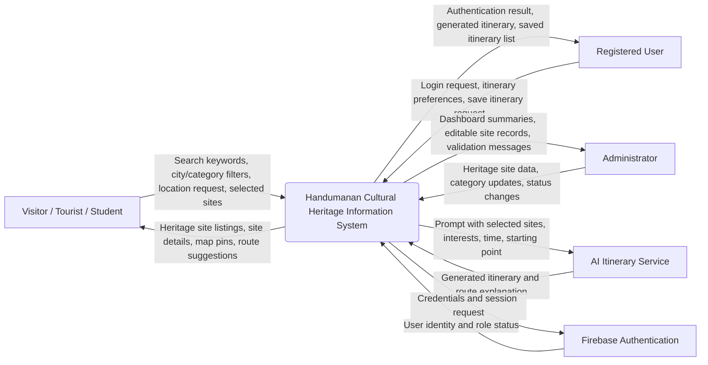

# System Diagrams and Use Case Descriptions

## Figure 4: Data Flow Diagram

The revised Data Flow Diagram (DFD) uses standard DFD symbols:

- External Entity: rectangle, used for people or outside services that interact with the system.
- Process: rounded rectangle, used for actions that transform input data into output data.
- Data Store: open-ended data store shape, used for stored records such as heritage sites, user profiles, and saved itineraries.
- Data Flow: labeled arrow, used for data moving between entities, processes, and data stores.

Decision diamonds, UI buttons, and page-layout boxes are not used in the DFD because those symbols belong to flowcharts or interface diagrams, not data flow diagrams.

### Level 0 DFD: Handumanan Context Diagram

**Level 0 Description**

The Level 0 DFD shows Handumanan as one complete system. Visitors, students, and tourists provide search terms, filters, selected sites, and location-related requests. The system returns heritage site information, directory results, map markers, and route suggestions. Registered users add authentication and itinerary-saving actions. Administrators maintain the heritage-site records and review dashboard information. The system also communicates with Firebase Authentication for identity and role checking and with the AI itinerary service for route generation.

### Level 1 DFD: Major Handumanan Processes

```mermaid
flowchart LR
    visitor[Visitor / Tourist / Student]
    user[Registered User]
    admin[Administrator]
    ai[AI Itinerary Service]
    auth[Firebase Authentication]

    p1(1.0 Browse and Search Heritage Sites)
    p2(2.0 View Site Details and Map)
    p3(3.0 Generate Heritage Itinerary)
    p4(4.0 Manage User Account and Saved Trips)
    p5(5.0 Manage Heritage Site Records)

    ds1[(D1 Heritage Site Data)]
    ds2[(D2 User Profiles)]
    ds3[(D3 Saved Itineraries)]
    ds4[(D4 Admin Site Records / Firestore Overrides)]

    visitor -->|Search text, city filter, category filter| p1
    p1 -->|Read active heritage records| ds1
    ds1 -->|Site names, descriptions, categories, images, ratings| p1
    p1 -->|Filtered directory results| visitor

    visitor -->|Selected site ID or map request| p2
    p2 -->|Read site details and coordinates| ds1
    ds1 -->|Overview, significance, location, gallery, coordinates| p2
    p2 -->|Detailed profile and map marker| visitor

    visitor -->|Starting point, time, interests, selected sites| p3
    user -->|Starting point, time, interests, selected sites| p3
    p3 -->|Read candidate heritage sites| ds1
    ds1 -->|Site data for planning| p3
    p3 -->|Planning prompt and site list| ai
    ai -->|Ordered itinerary, durations, route summary| p3
    p3 -->|Generated itinerary| visitor
    p3 -->|Generated itinerary| user
    p3 -->|Save itinerary data| ds3

    user -->|Email/password login, profile request, saved trips request| p4
    p4 -->|Authentication request| auth
    auth -->|User ID and session state| p4
    p4 -->|Read/write profile| ds2
    p4 -->|Read saved itineraries| ds3
    ds2 -->|Profile data and role| p4
    ds3 -->|Saved itinerary records| p4
    p4 -->|Profile and saved trip list| user

    admin -->|Create, edit, hide, delete, validate site records| p5
    p5 -->|Verify admin role| ds2
    ds2 -->|Admin role status| p5
    p5 -->|Read built-in and Firestore site records| ds1
    p5 -->|Create/update/delete overrides| ds4
    ds1 -->|Current built-in directory records| p5
    ds4 -->|Admin-managed site records| p5
    p5 -->|Dashboard statistics, record table, save/delete confirmation| admin
```

**Level 1 Description**

The Level 1 DFD expands the Handumanan system into five major processes. Process 1.0 handles public browsing and filtering by reading heritage records and returning matching directory results. Process 2.0 retrieves a selected site record and presents full information, gallery images, and map coordinates. Process 3.0 uses selected heritage sites, interests, starting point, and available time to generate an itinerary through the AI itinerary service, then optionally stores the plan for signed-in users. Process 4.0 manages account access, profile data, and saved itineraries through Firebase Authentication and Firestore user records. Process 5.0 is used by administrators to maintain heritage site information, including updates that override or extend built-in records.

## Use Case Diagram Descriptions

### Use Case Diagram 1: Visitor Heritage Discovery

**Primary Actor:** Visitor, tourist, or student

**Goal:** Find Metro Cebu heritage sites and learn relevant visitor and historical information.

**Included Use Cases:**

- Browse featured heritage sites.
- Search the site directory.
- Filter sites by city.
- Filter sites by category.
- View a heritage site profile.
- View map location and coordinates.
- Read historical overview and significance.
- Open gallery images.

**Description:**

This use case starts when a visitor opens Handumanan without needing an account. The visitor can browse highlighted heritage sites from the home page or go directly to the directory. In the directory, the visitor enters a search term or chooses city and category filters. The system searches the heritage-site data and returns matching records with site name, image, city, category, rating, and short description. When the visitor selects a site, the system displays the complete profile, including overview, historical significance, visitor hours, accessibility, images, and location details. This use case supports casual tourists, students doing research, and users planning where to go next.

**Preconditions:**

- The system is accessible through a web browser.
- Heritage site records are available in the built-in dataset or Firestore.

**Postconditions:**

- The visitor has viewed a filtered list or a detailed heritage site profile.
- No login is required and no user data is stored unless the visitor chooses an account-related feature.

### Use Case Diagram 2: Itinerary Planning

**Primary Actor:** Visitor or registered user

**Supporting Actor:** AI itinerary service

**Goal:** Generate a realistic heritage route based on user preferences.

**Included Use Cases:**

- Enter starting point.
- Set available travel time.
- Select interests.
- Generate itinerary.
- View ordered stops.
- View estimated visit durations.
- View route summary.
- Save itinerary, for registered users only.

**Description:**

This use case begins when the user opens the itinerary planner. The user provides a starting point, available time, and preferred interests such as history, architecture, religious sites, photography, Spanish heritage, parks, or World War II history. The system sends the selected preferences and available heritage-site data to the itinerary process. If an AI service is available, the system requests an ordered route from the service. If the AI service is unavailable, the system can still create a local fallback itinerary from the available site list. The result is shown as a sequence of stops with estimated visit durations and an explanation of why each stop fits the route. A registered user can save the itinerary to their account for later viewing.

**Preconditions:**

- Heritage site data exists in the system.
- The user has entered enough planning preferences to generate a route.
- Saving requires the user to be signed in.

**Postconditions:**

- The system displays a generated itinerary.
- If the user is signed in and chooses to save, the itinerary is stored in the user's saved trips.

### Use Case Diagram 3: User Account and Saved Trips

**Primary Actor:** Registered user

**Supporting Actor:** Firebase Authentication

**Goal:** Allow a user to sign in and access saved itinerary records.

**Included Use Cases:**

- Register or sign in.
- Maintain authenticated session.
- View profile page.
- View saved itineraries.
- Save generated itinerary.
- Sign out.

**Description:**

This use case starts when a user chooses an account-related action, such as signing in or saving a generated itinerary. The system sends the authentication request to Firebase Authentication and receives the user identity and session state. After login, the system can read the user's profile record and saved itinerary records from Firestore. When the user saves an itinerary, the system stores the generated route, summary, and creation date under that user's account. This separates casual browsing from personalized trip storage while keeping saved trip records tied to the authenticated user.

**Preconditions:**

- The user has a valid account or can create one.
- Firebase Authentication is configured.

**Postconditions:**

- The user is signed in or signed out based on their action.
- Saved itinerary records are available in the user's profile when storage succeeds.

### Use Case Diagram 4: Administrator Heritage Site Management

**Primary Actor:** Administrator

**Goal:** Maintain accurate and complete heritage site records for public use.

**Included Use Cases:**

- Log in as administrator.
- View dashboard statistics.
- Search and filter site records.
- Add heritage site.
- Edit heritage site.
- Hide or deactivate site.
- Delete Firestore-created site record.
- Manage categories summary.
- Validate required site fields.
- Review record completeness.

**Description:**

This use case begins when an administrator logs in through the admin login page. The system checks the user's account and confirms that the user's role is admin before allowing access to the admin dashboard. Inside the dashboard, the administrator can view site totals, active records, records needing review, and image completeness information. The administrator can search and filter records, open a create or edit form, and maintain fields such as official name, city, category, location, visiting hours, image URL, gallery images, overview, significance, coordinates, rating, tags, activity status, demolition status, and verification status. When the administrator saves a record, the system validates required fields and stores the record or override in Firestore. When the administrator hides a built-in record, the system creates an inactive Firestore override instead of removing the built-in dataset.

**Preconditions:**

- The user is authenticated.
- The user's profile has an administrator role.
- Firestore rules allow the administrator to manage heritage site records.

**Postconditions:**

- Heritage site records are created, updated, hidden, or deleted according to the administrator's action.
- Public directory, map, details, chatbot context, and itinerary planning can use the updated record data.

### Use Case Diagram 5: Heritage Map and Route Discovery

**Primary Actor:** Visitor, tourist, student, or registered user

**Goal:** Explore heritage sites geographically and understand where sites are located.

**Included Use Cases:**

- View interactive map.
- Display heritage site markers.
- Select map marker.
- View selected site preview.
- Open full site details.
- Use location-based discovery.
- Request route/navigation support.

**Description:**

This use case starts when the user opens a map-based discovery page or selects a site with coordinates. The system reads active heritage site records and their latitude and longitude values, then displays them as map markers. The user can select a marker to preview the site and open the full profile for deeper information. When location-based discovery is used, the system can compare the user's location or chosen area with stored site coordinates to suggest nearby heritage sites. This use case helps users move from text-based discovery to spatial planning, which is important for visitors creating an actual Metro Cebu heritage route.

**Preconditions:**

- Heritage site records include valid latitude and longitude coordinates.
- The map component is available in the browser.
- Location-based features require browser location permission or a manually provided location.

**Postconditions:**

- The user has viewed heritage sites on a map or selected a location-based recommendation.
- No account is required unless the user saves a generated itinerary.
